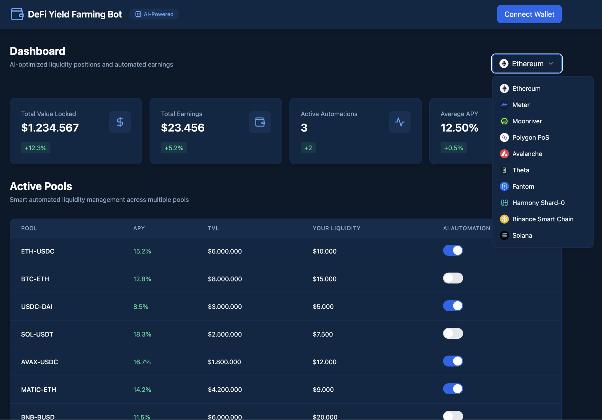

# 🌾 UltimateFarmingBot

**AI-Powered DeFi Yield Farming Automation**

*Automated liquidity management and yield optimization across 12 blockchain networks*

---

---

## Overview

UltimateFarmingBot is a professional-grade, AI-driven yield farming solution designed to maximize DeFi returns through intelligent liquidity management and automated pool optimization. The bot continuously monitors market conditions across multiple chains and executes strategies to ensure optimal yield at all times.

---

## Supported Networks

| Network | Network | Network |
|---|---|---|
| Ethereum | Fuse | Telos |
| Meter | Moonriver | Polygon PoS |
| Avalanche | Theta | Fantom |
| Harmony Shard-0 | Binance Smart Chain | Solana |

---

## Features

### ⚙️ User-Friendly Configuration
Intuitive settings panel to fully customize farming strategies without technical complexity.

### 🌐 Multi-Network Support
Seamlessly operates across **12 blockchain networks** from a single unified interface.

### 📈 Yield Optimization
Continuously analyzes liquidity pools in real-time to identify the most profitable opportunities.

### 🤖 Automated Liquidity Provision
End-to-end automation of liquidity operations — deposit, rebalance, and withdraw — all handled autonomously.

---

## Active Pool Performance

| Pool | APY | TVL |
|---|---|---|
| ETH-USDC | 15.2% | $5,000,000 |
| BTC-ETH | 12.8% | $8,000,000 |
| USDC-DAI | 8.5% | $3,000,000 |
| SOL-USDT | 18.3% | $2,500,000 |
| AVAX-USDC | 16.7% | $1,800,000 |
| MATIC-ETH | 14.2% | $4,200,000 |

---

## Legal & Usage

This project is **proprietary software** developed and exclusively maintained by **projectAdnan**.

> ⚠️ **Update requests will not be entertained.**
> 🚫 **External contributions are not accepted.**

---

  Built with precision by <strong>projectAdnan</strong>

